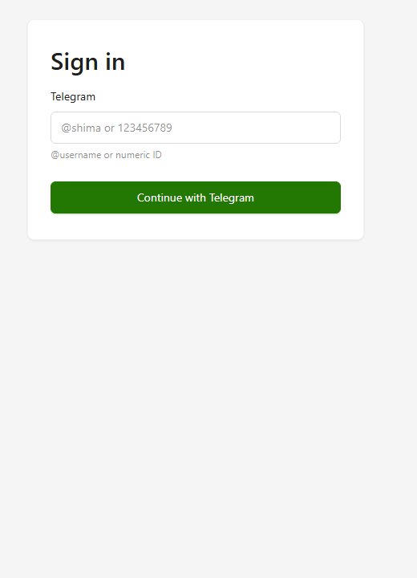
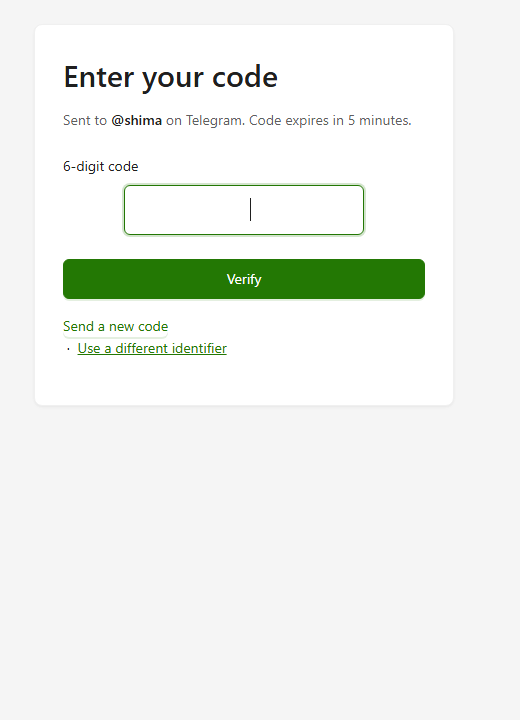
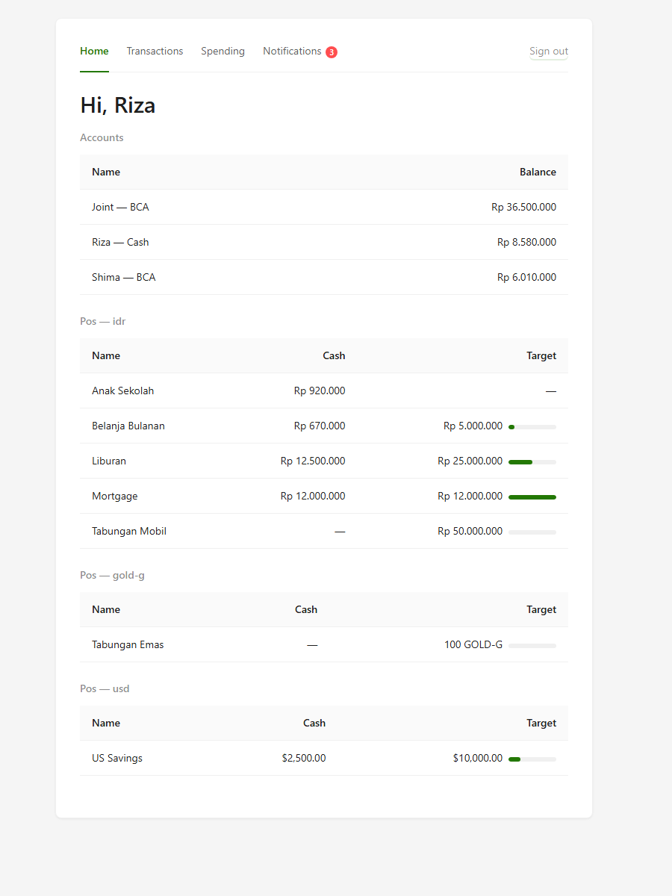
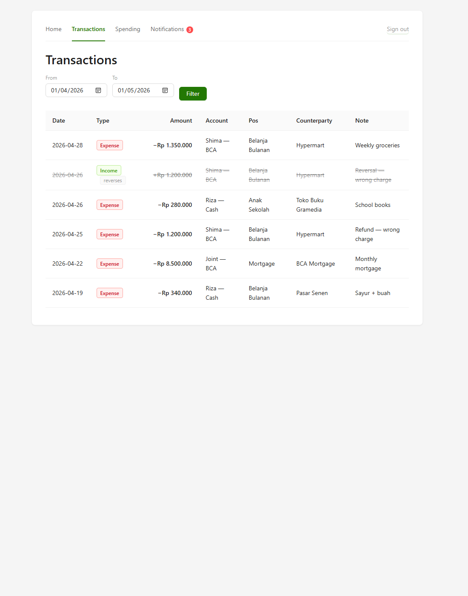
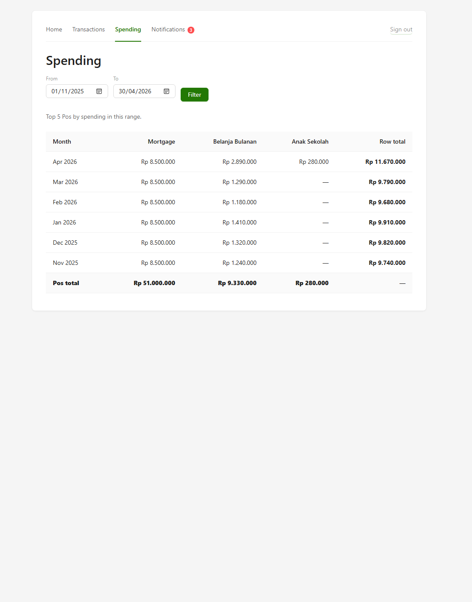
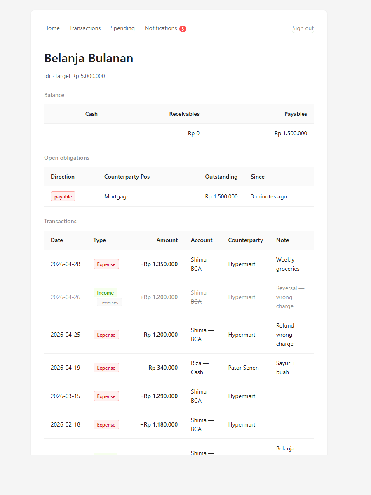
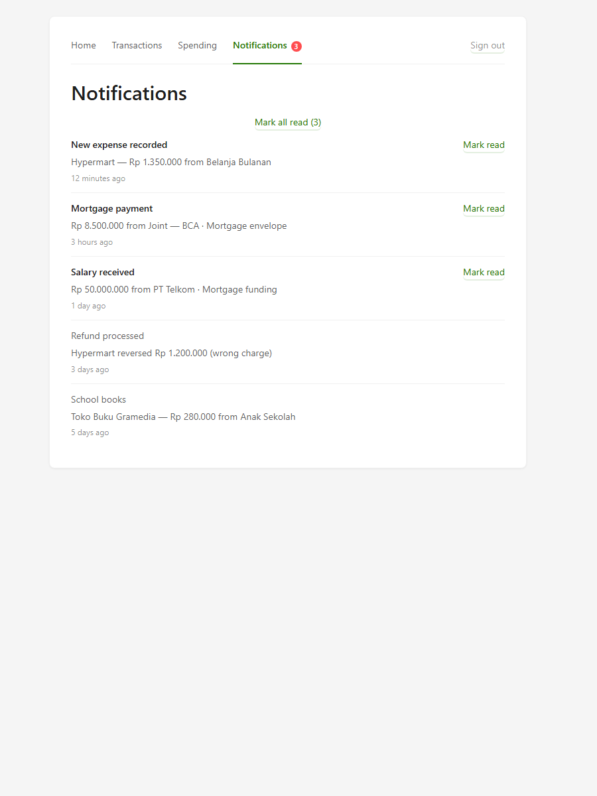

# financial-shima — UI showcase

A two-user family financial manager. Telegram OTP login, multi-currency
Pos envelope budgeting (IDR + USD), and an append-only ledger with
inter-Pos transfers and obligations.

The visual layer is **Ant Design v5** with the Polar Green palette —
primary shifted to **green-8 `#237804`** so primary text on white
clears WCAG AA at ~6:1, while `--success` stays at green-6 to keep
the two semantic tokens distinct.

**Every authenticated screenshot below is rendered from the real
handler→Postgres→template path** — the same code that runs in
production, against the seeded data in `db/seed/demo.sql`. Account
balances and Pos cash are derived live by folding every money_in /
money_out row through `logic/balance.State` (per spec §4.2 — no
stored balance column). No mockup, no hand-curated data structs.

## Pre-auth — compact card (`max-width: 420px`)

### Sign in


### Verify code
6-digit code input with monospace + letter-spacing + text-indent.



## Home — derived account & Pos balances

`Hi, Riza` greets the signed-in user. Three accounts, all with
positive IDR balances derived by event-folding. Pos rows grouped by
currency (IDR · gold-g · USD), each carrying its budget-progress rail
where a target is set. Mortgage at 100% (full bar), Liburan at 50%,
Belanja Bulanan at 13%, US Savings at 25% of $10K.



## Transactions — chips + colored amounts

Income / Expense / Transfer chips, color-coded amounts (green `+` for
income, neutral for expense, muted for transfers). The reversed
charge renders line-through with a `reverses →` link back to the
original. USD and IDR formatting share the same column.



## Spending — months × top-N Pos pivot

Six months of spending grouped by Pos. Mortgage's flat 8.5M monthly
draws stand out against the noisier groceries column; April spikes
because of the (subsequently reversed) wrong charge plus an extra
Pasar Senen trip. Pos-totals row at the bottom; row totals on the
right. Wide card modifier (`max-width: 920px`) for data density.



## Pos detail — balance, obligations, scoped transactions

Drill-in for Belanja Bulanan: target Rp 5.000.000, payable to
Mortgage Rp 1.500.000 (open obligation, surfaced via JOIN so the
counterparty Pos resolves to its name, not its UUID). Below: the
chronological list of transactions scoped to this Pos, including
the wrong-charge / reversal pair.



## Notifications — read/unread feed

Three unread (bold) at the top, two read below (faded). Each item
has a per-item *Mark read* affordance plus a top-of-feed *Mark all
read (3)* button. Relative timestamps render via the `relTime`
template func.



## Reproducing locally

```bash
# Start Postgres, apply migrations, then load the seed:
psql $DATABASE_URL -f db/seed/demo.sql

# Render any authenticated route through the real handler stack:
export DATABASE_URL=postgres://postgres@localhost:5432/financial_shima?sslmode=disable
go run ./scripts/dump_real.go {home|transactions|spending|notifications|pos} > out.html

# Headless screenshot with any modern Chromium:
msedge --headless=new --screenshot=out.png --window-size=1100,1200 file:///path/to/out.html
```

## Known gaps

- **Pos-detail Cash** still renders em-dash. The handler doesn't yet
  populate `PosDetailData.Cash` (no field on the struct). Fixable in
  a follow-up by mirroring the home-handler's `computeBalanceState`.
- **inter_pos transactions** are excluded from balance computation —
  Phase-7 schema work (`inter_pos_lines` table) ships separately;
  until then, balance only reflects money_in / money_out events.
- **Login & Verify** are static (no DB needed); shown here as design
  reference, not real-data renders.
