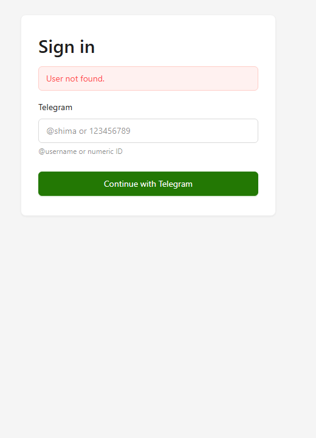

# financial-shima — UI walkthrough

A two-user family financial manager. Telegram OTP login, multi-currency
Pos envelope budgeting (IDR + USD + gold-g), and an append-only ledger
with inter-Pos obligations.

The visual layer is **Ant Design v5** with the **Polar Green** palette
(primary `#237804` — green-8, AA-clear on white at ~6:1; success
remains green-6 to keep the two semantic tokens distinct).

Every authenticated screenshot below is rendered through the
real handler → Postgres → template path against the seeded data in
`db/seed/demo.sql`. Account balances and Pos cash are derived live by
folding every `money_in` / `money_out` row through `logic/balance.State`
(per spec §4.2 — no stored balance column).

This page maps the implemented scenarios in
[`0002-mvp-user-scenarios.md`](spec/0002-mvp-user-scenarios.md) to
their primary screenshot. Scenarios that don't yet have UI (S5–S15
transaction-creation forms, S23–S25 LLM API endpoints) are listed at
the bottom under **Open gaps**.

---

## Authentication

### S1 — Riza logs in with OTP

Compact card (`max-width: 420px`). One input — `@username` or numeric
Telegram ID. Submit posts to `/login`, generates a 6-digit code,
records it server-side with a 5-minute expiry, and dispatches it via
the OTP assistant.


### S2 — Login fails (unknown identifier)

Lookup misses → page re-renders with the inline alert. No OTP is
sent; the form is safe to retry within rate limits. Wrong-OTP and
expired-OTP variants reuse the same alert region on `/verify`.



### S1 (cont.) — OTP entry

After a valid identifier the user is redirected to `/verify`. Code
input is monospace + `letter-spacing: 0.6em` + `text-indent` for
optical centering. On a verified code, a 7-day rolling session cookie
is issued (Secure, HttpOnly, SameSite=Lax).


### S3 — Riza logs out

Sign-out lives in the top-right of the global nav (visible across all
authenticated screenshots). Submitting it revokes the session row in
the DB and clears the cookie; subsequent requests redirect to
`/login`.

### S4 — Session expires after 7 days

Rolling 7-day window — every authenticated request renews the
session's `expires_at`. Past the window the session is invalid and
the next request lands back on `/login`.

---

## Recording — current state

> S5–S15 cover the new-transaction / inter-Pos / edit / delete flows.
> The validation rules (§5.1), balance computation (§4.2), and
> obligation matching (§4.3) are all implemented in `logic/balance` +
> `logic/obligation` with full property-test coverage; the **web
> form** to drive them isn't wired yet. See **Open gaps**.

The screenshots below all reflect transactions seeded via the demo
SQL going through the same insert path the future form will use.

---

## Balances and views

### S17 — Home dashboard

Three accounts (Joint BCA, Riza Cash, Shima BCA) render derived IDR
balances. Pos rows grouped by currency: IDR (5 rows including the
deliberately-overdrawn **Petty Cash**), gold-g (Tabungan Emas at 0),
USD (US Savings at $2,500 / $10,000 — 25% of target).

Mortgage at 100% target progress (full bar), Liburan at 50%,
Belanja Bulanan at 13%.


### S20 — Resolve a Pos with negative cash

The **Petty Cash** row in the screenshot above shows the negative-cash
marker (`▾ -Rp 350.000` in error red). Per spec §5.5 the system
imposes nothing — the user resolves by reallocating from another Pos
(S8), allocating future income (S5), or simply acknowledging the
deficit.

### S16 — Browse the transaction list

Default view: last 30 days, all accounts/Pos/counterparties/types,
newest first. Each row shows date, type chip, sign-prefixed colored
amount (income green `+`, expense default, transfers muted), account,
Pos, counterparty, note. Reversal rows render with strikethrough +
`reverses →` link.

The April reversal pair (a wrong charge from Hypermart and its
subsequent +Rp 1.200.000 reversal) is visible mid-table.


### S18 — Drill into a Pos breakdown

`/pos/:id` renders name, currency, target, balance row (Cash /
Receivables / Payables, all formatted via `money()`), open
obligations table with direction chip + counterparty Pos resolved by
name (not UUID), and the chronological transaction list scoped to
this Pos.

The Belanja Bulanan view below shows the open obligation (`payable`,
to **Mortgage**, Rp 1.500.000) seeded as the household borrow
scenario.


### S19 — View spending by Pos over time

`/spending` defaults to last 6 months × top-N Pos by spending volume.
Months are rows, Pos are columns; per-cell currency formatting; row
totals + Pos totals on edges. Wide card modifier (`max-width:
920px`) for data density.

The flat 8.5M monthly Mortgage column is the household's most
predictable outflow; Belanja varies; Anak Sekolah only shows in
April.


---

## Notifications

### S22 — Notifications feed

`/notifications` renders the per-user feed newest-first. Three unread
(bold) at the top (live counter on the nav); two read (faded) below.
Each item carries a `Mark read` button; the top of the feed has a
`Mark all read (3)` aggregate.

Notifications fire in the same DB transaction as the underlying
ledger insert (§5.4 / §10.8) — atomically, never partial.


### S21 — Shima sees a notification when Riza posts

Not a single screenshot — a side-effect of every S5 / S6 / S8–S15
insert. The recipient rule (`logic/notification.RecipientsFor`)
excludes the creator: Shima never receives notifications for her own
actions. The bell badge (visible on every nav screenshot above)
updates server-side on the next page load.

---

## LLM API (S23–S26) — current state

`web/middleware/APIKey` enforces `x-api-key` per spec §7.2 with
constant-time comparison; missing or invalid keys return `401` with
`{"error": "missing_api_key" | "invalid_api_key", "message": "…"}`.
`GET /api/v1/accounts` is wired with `?include_archived=true`
support.

POST endpoints (`/accounts`, `/pos`, `/transactions`),
`GET /api/v1/transactions`, and
`POST /api/v1/transactions/:id/reverse` are not yet implemented; see
`docs/spec/0001-mvp-progress.md` for Phase-10 status.

---

## Open gaps

These scenarios in `0002-mvp-user-scenarios.md` aren't yet shippable
through the UI; their backing logic is in place but the entry surface
is pending.

| Scenarios | Missing surface |
|---|---|
| S5, S6 | New-transaction form (money_in / money_out) |
| S7 | Counterparty autocomplete + inline create |
| S8, S9, S10 | Inter-Pos transfer / borrow / repayment forms |
| S11, S12 | Multi-currency variants of the above |
| S13, S14, S15 | Edit / reverse-and-re-enter / delete affordances |
| S16 | Multi-select filters (account / Pos / counterparty / type) — only date range works today |
| S17 | Receivables / Payables per Pos row on `/home` (Pos detail has them) |
| S23, S24, S25 | POST `/api/v1/{accounts,pos,transactions}` + GET list + reverse |

## Reproducing locally

```bash
# 1. Apply migrations and load demo data:
psql $DATABASE_URL -f db/seed/demo.sql

# 2. Render any authenticated route through the real handler stack:
export DATABASE_URL=postgres://postgres@localhost:5432/financial_shima?sslmode=disable
go run ./scripts/dump_real.go {home|transactions|spending|notifications|pos} > out.html

# 3. Login + login-error + verify (no DB needed):
go run ./scripts/dump_login.go        > login.html
go run ./scripts/dump_login_error.go  > login_error.html
go run ./scripts/dump_verify.go       > verify.html

# 4. Headless screenshot with any modern Chromium:
msedge --headless=new --screenshot=out.png --window-size=1100,1300 file:///path/to/out.html
```
