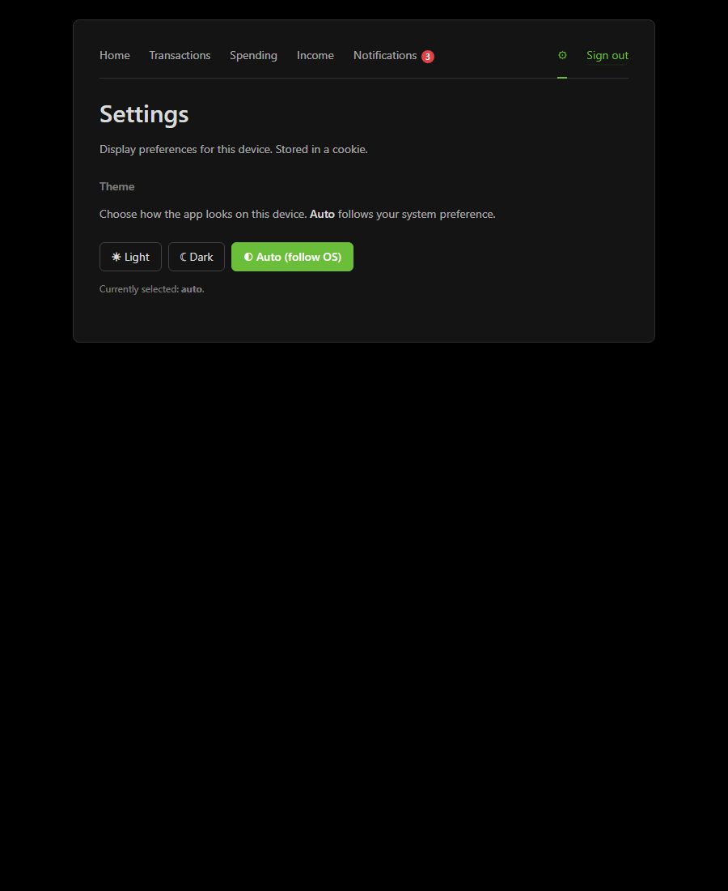
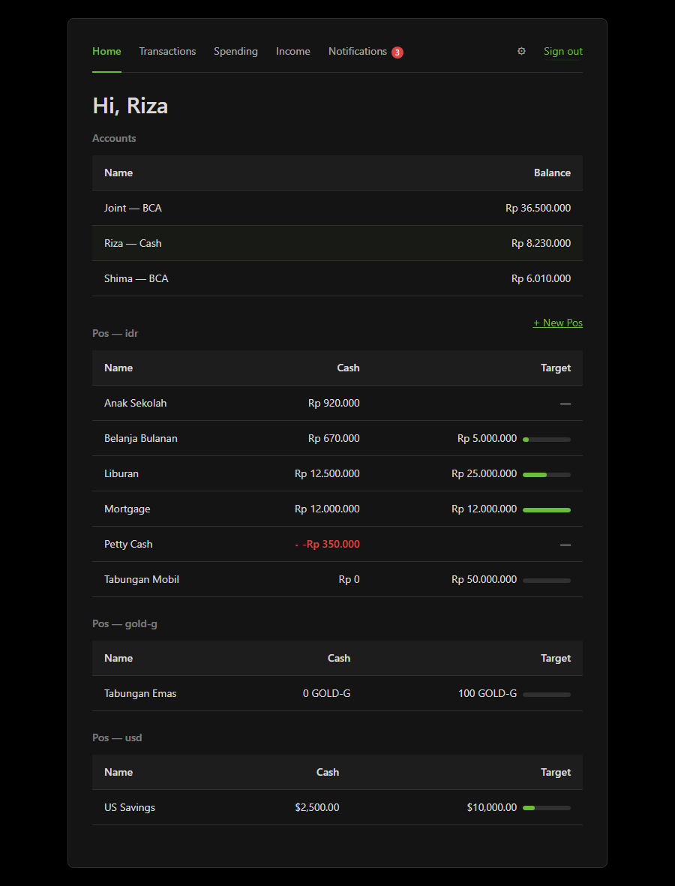
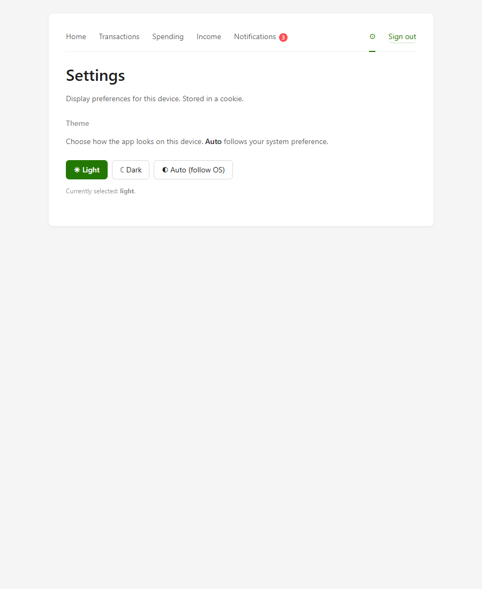
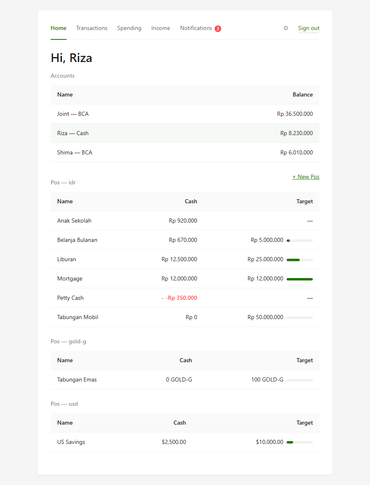
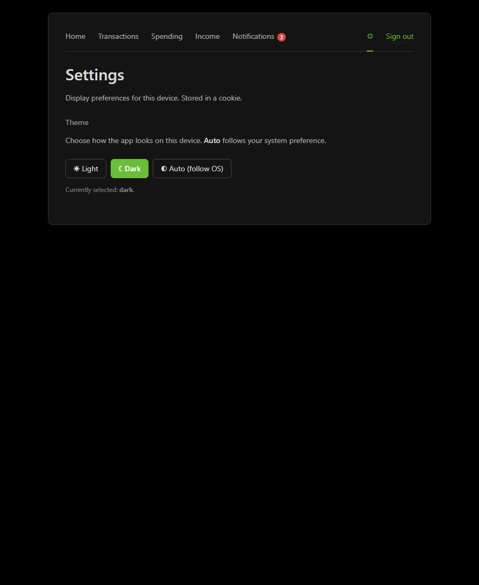

# Theme switcher

Per-device preference: **light**, **dark**, or **auto** (follow OS).
Stored in a cookie (`shima_theme`); zero JS, pure CSS variable
overrides on `<html>`.

→ [Settings page](https://github.com/rizaramadan/financial-shima/blob/main/web/handler/settings.go) ←
[Repo](https://github.com/rizaramadan/financial-shima)

## How it works

1. CSS defines three custom-property blocks:
   - `:root { … light tokens … }` — default, applies to everyone.
   - `@media (prefers-color-scheme: dark) :root { … dark tokens … }`
     — auto path: kicks in when the OS prefers dark **and** no
     explicit choice is set.
   - `:root[data-theme="light"]` and `:root[data-theme="dark"]` —
     beat the media query, override OS.
2. Server middleware reads `shima_theme` cookie, attaches the value
   to the request context.
3. The Renderer clones the parsed template tree per request, registers
   a `themeAttr` template function that closes over the request's
   theme value, then executes. `<html lang="en"{{themeAttr}}>` becomes
   either bare (auto) or `<html lang="en" data-theme="dark">`.

No localStorage, no JS, no fetch. The cookie is the only state.
Re-render on choice = full page reload (HTML form POST).

## All three states (system theme = dark for these shots)

### Auto (no override) — CSS @media decides → dark

| Settings page | Home |
|---|---|
|  |  |

### Explicit Light — overrides the dark OS preference

| Settings page | Home |
|---|---|
|  |  |

### Explicit Dark

| Settings page | Home |
|---|---|
|  |  |

## Cookie shape

```
Set-Cookie: shima_theme=dark; Path=/; Max-Age=31536000; SameSite=Lax
```

For "Auto", the server clears the cookie (`Max-Age=-1`). The cookie
is intentionally **not** HttpOnly — it's a UI preference, not a
secret, and JS may want to read it later.

## Reproducing locally

```bash
go run ./scripts/dev_server.go &
node scripts/playwright/theme.js
# → 6 PNGs in docs/screenshots/theme/, one per (theme × page)
```
